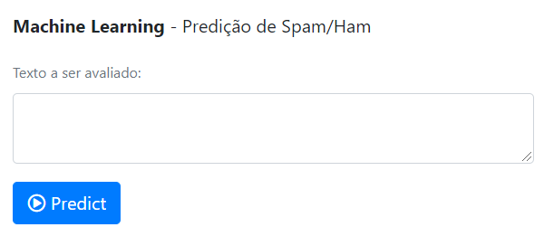

# Machine Learning

## Predição de Spam/Ham

O modelo Naive Bayes foi gerado via Jupyter Notebook.
Uma interface para realização das predições foi elaborada utilizado Flask.

Demo: https://spamhamclassifier.herokuapp.com/

Base de dados utilizada: http://nlp.cs.aueb.gr/software_and_datasets/Enron-Spam/index.html